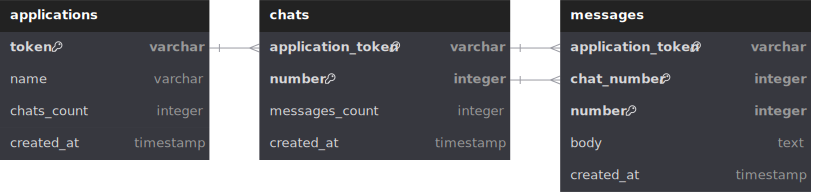

# Instabug chat system

## **Table of Contents**

1. [Overview](#overview)
2. [How to Run the Project Locally](#how-to-run-the-project-locally)
3. [Implementation Discussion](#implementation-discussion)

## Overview
This repository contains a chat system developed as a task for Instabug, utilizing Ruby on Rails and Mysql.


### Features
- **Sidekiq Integration**: Uses Sidekiq for background job processing, allowing asynchronous handling of message queuing and request processing.
- **Elasticsearch Search**: Integrates Elasticsearch to enable efficient full-text search for messages.
- **API**: Offers a RESTful API with CRUD operations for managing applications, chats, and messages.
- **Containerization**: Employs Docker Compose for streamlined deployment and scalability.
- **MySQL**: Stores all data in MySQL, ensuring compatibility with Rails.
- **Scheduled Task**: Includes a cron job that runs hourly to synchronize chat and message counts.

## How to run the project locally

### Used Ports

This application uses the following ports:

- **3000**: Rails server.
- **3306**: MySQL database.
- **9200**: Elasticsearch.
- **5601**: Kibana (Visual dashboard for ES).
- **6379**: Redis.

_Make sure these ports are available and not in use by other services on your machine._

### Setup
1. **Clone the repo**

   Start by cloning the repository to your local machine:

   ```bash
   git clone https://github.com/badrannn/instabug_task_chat_system.git
   cd instabug_task_chat_system
   
3. **Run the project with Docker**

   To start the application using Docker, execute the following command:

   ```bash
   docker-compose up --build

### Running the unit tests
1. Attach a shell to the rails app container
2. Run the tests
   ```bash
   bundle exec rspec
   
### API endpoints
_your project should be running over localhost:3000_

#### Applications
- **Update Application**  (only permissible to modify the name through a JSON body)
  
  `PATCH /applications/:token`

  **Example Request Body:**
  
   ```json
   {
       "application": {
           "name": "updated_name"
       }
   }
  

- **Create Application**  
  `POST /applications`

   **Example Request Body:**
  
   ```json
   {
       "application": {
           "name": "example_name"
       }
   }


- **Show Application**  (__nested associated resources__)

  `GET /applications/:token`

  **Example response**
  ```json
   {
    "name": "test_3",
    "token": "kcbR52tHqNJ11pDCYoMP6A",
    "chats_count": 0,
    "chats": [
        {
            "number": 1,
            "messages_count": 0,
            "messages": [
                {
                    "number": 1,
                    "body": "testing"
                },
                {
                    "number": 2,
                    "body": "testing_2"
                }
            ]
        },
        {
            "number": 2,
            "messages_count": 0,
            "messages": []
        }
    ]


#### Chats
- **List Chats**  
  `GET /applications/:application_token/chats`
   **Example Request Body:**
  
   ```json
   [
    {
        "number": 1,
        "messages_count": 2,
        "messages": [
            {
                "number": 1,
                "body": "testing"
            },
            {
                "number": 2,
                "body": "testing_2"
            }
        ]
    },
    {
        "number": 2,
        "messages_count": 0,
        "messages": []
    },
    {
        "number": 3,
        "messages_count": 0,
        "messages": []
    }


- **Create Chat**  
  `POST /applications/:application_token/chats` **--> Returns: chat_number**

- **Show Chat**  
  `GET /applications/:application_token/chats/:number`

   **Example response:**
   ```json
   {
    "number": 1,
    "messages_count": 0,
    "messages": [
        {
            "number": 1,
            "body": "testing"
        },
        {
            "number": 2,
            "body": "testing_2"
        }
    ]


#### Messages
- **List Messages**  
  `GET /applications/:application_token/chats/:chat_number/messages`


  **Example response:**
  
   ```json
  
  [
    {
        "number": 1,
        "body": "testing"
    },
    {
        "number": 2,
        "body": "testing_2"
    }


- **Create Message**  
  `POST /applications/:application_token/chats/:chat_number/messages`

  **Example Request Body:**
  
   ```json
   {
       "message": {
           "body": "sample_content"
       }
   }
  

- **Show Message**  
  `GET /applications/:application_token/chats/:chat_number/messages/:number`

  **Example response:**
  
   ```json
  {
    "number": 1,
    "body": "testing"
  }
  

- **Search Messages**  (Utilizes ElasticSearch)

  `GET /applications/:application_token/chats/:chat_number/messages/search?query=your_query`

  **Example response:**
  ```json
  
  [
    {
        "number": 1,
        "body": "testing"
    },
    {
        "number": 2,
        "body": "testing_2"
    }

## Implementation Discussion

#### Database Design
The database design for the chat system is illustrated in the following graphic:




In this design:

- **Applications Table**: Stores information about each application, including its unique token (PK) and name.
- **Chats Table**: An application token and a unique number identify each chat. The primary key is a composite key consisting of the application token, which serves as a foreign key, and the chat number.
- **Messages Table**: Each message is linked to a specific chat through the chat number and application_token. The primary key is a composite key consisting of the application token, the chat_number, which serves as a foreign key, and the message number.

### Created Indexes

- **Applications Table**:
  - `index_applications_on_token`: This index speeds up queries that search for applications using the token field.

- **Chats Table**:
  - `index_chats_on_application_token_and_number`: A unique index that ensures the combination of `application_token` and `number` is unique, preventing duplicates.
  - `index_chats_on_application_token`: This index improves the performance of queries that filter chats based on the `application_token`.

- **Messages Table**:
  - `index_messages_on_application_token_and_chat_number_and_number`: A unique index that ensures the combination of `application_token`, `chat_number`, and `number` is unique, maintaining data integrity.
  - `index_messages_on_application_token_and_chat_number`: This index enhances the performance of queries that retrieve all messages related to a certain chat.


### Asynchronous Jobs for Database Writes
To enhance performance and responsiveness and introduce concurrency control, the application leverages background jobs for writing to the database. This asynchronous behavior is implemented using Sidekiq.

- **ApplicationCreationJob**: 
  - Responsible for handling the creation of new application records. When an application is initiated, a job is enqueued, and the application responds immediately to the user with the token. The actual database writing occurs in the background.

- **ChatCreationJob**: 
  - Responsible for handling the creation of new chat records. When a chat is initiated, a job is enqueued, and the application responds immediately to the user with the chat number. 

- **MessageCreationJob**: 
  - Similar to `ChatCreationJob`, this job handles the creation of messages within a chat. By enqueuing the job, the application can quickly inform users of their message number.

- **CountUpdaterJob**: 
  - Responsible for updating the `chat_count` and `message_count` in the database. Scheduled to run every 45 minutes. By running this job asynchronously, the application can maintain accurate counts without impacting the performance of user-facing operations.

### Integrating Elasticsearch

**Indexing Messages**:
   - Each time a message is created or updated, it is indexed in Elasticsearch. This process ensures that the message body is searchable.

**Full-Text Search**:
   - Supports full-text search, enabling search for keywords within the message body.

A **Searchable** concern was created to encapsulate the logic for indexing and searching.
